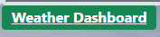
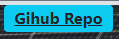
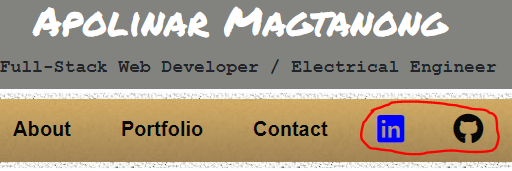

# Update Portfolio 2

This project is an updated version of the 'Responsive Portfolio using Bootstrap' project.

## Project Notes

Some enhancement were done in this project particularly the use of Bootstrap 5 to re-design the pages.

Background image and google fonts were also added to improve the typography of the pages.

In the Portfolio page, three of the homeworks, project1 and project3 were highlighted. 

To open deployed project URL and Github repository, click the icons below each project/homework image:

LinkedIn and Github pages in the About Me Page as shown below:

## The application could be accessed using the following link:
https://apolinar1607.github.io/Updated-Portfolio-2/

## The repo for the application could be accessed using the following link:
https://github.com/apolinar1607/Updated-Portfolio-2.git

